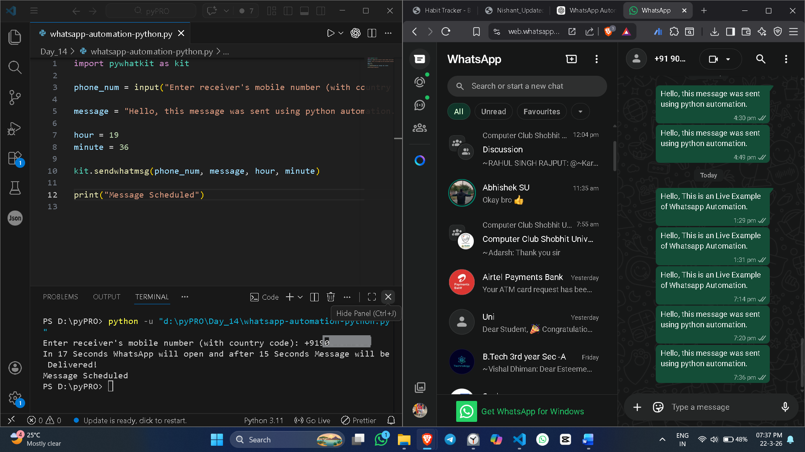

# WhatsApp Automation Bot

Python script to automatically send WhatsApp messages.

## Features
- Send scheduled messages
- Opens WhatsApp Web automatically
- Automation using Python

## Project Demo

## Installation
pip install -r requirements.txt

## Usage
python src/main.py

## Author
Nishant Chauhan
